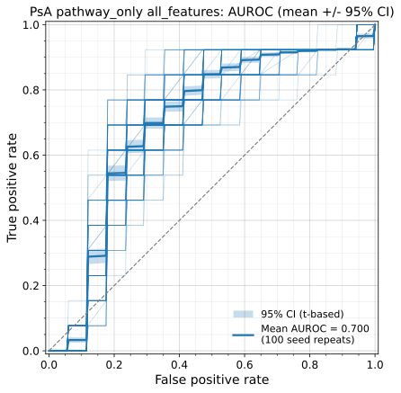
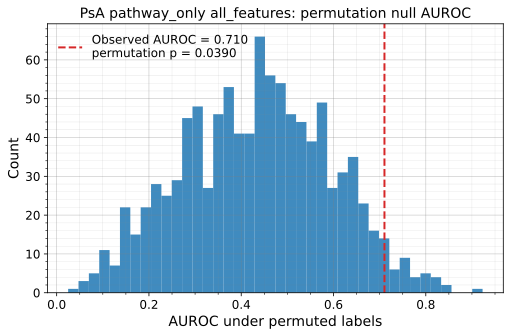
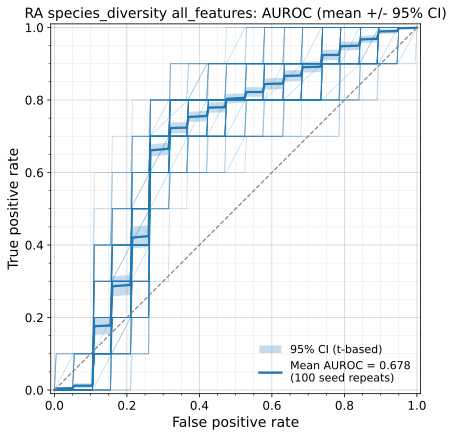
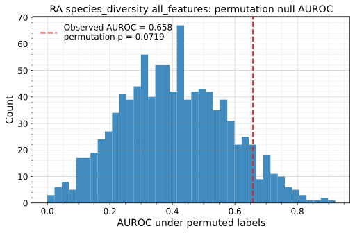

# MicrobiomeRFBench

**Random-forest classification of methotrexate (MTX) response from the gut microbiome in rheumatoid arthritis (RA) and psoriatic arthritis (PsA).**

This repository contains a single, self-contained pipeline that predicts whether a
patient's arthritis is an **inefficiency** (non-responder) or a **remission**
(responder) to methotrexate from their baseline gut-microbiome profile, together
with the example inputs, outputs and figures needed to reproduce the analysis.

For every disease group (RA, PsA) and feature set (`pathway_only`,
`species_diversity`) the pipeline reports, in one run:

- a **permutation p-value** — is the classifier better than chance? and
- a **repeated-seed 95% confidence band** on the ROC curve and AUROC — how stable
  is the result across reruns?

All figures are written as **SVG**.

---

## Results at a glance

Nested leave-one-out cross-validation, impurity-based in-fold feature screen
(top 50), inner-CV random-forest tuning. AUROC is the mean over **100 seed
repeats** with a t-based 95% CI; the p-value is from **1,000 label permutations**
of the base-seed model.

| Group | Feature set | n (inefficiency / remission) | Features | Mean AUROC [95% CI] | Permutation p |
|:-----:|:------------|:----------------------------:|:--------:|:-------------------:|:-------------:|
| **PsA** | `pathway_only`       | 30 (13 / 17) | 552  | **0.700** [0.696, 0.705] | **0.039** |
| **RA**  | `species_diversity`  | 29 (10 / 19) | 1290 | **0.678** [0.671, 0.685] | 0.072 |
| PsA | `species_diversity`  | 30 (13 / 17) | 1237 | 0.503 [0.496, 0.511] | 0.319 |
| RA  | `pathway_only`       | 29 (10 / 19) | 569  | 0.396 [0.386, 0.406] | 0.516 |

Only the **PsA pathway** model separates responders from non-responders
significantly better than chance (p = 0.039); the RA species/diversity model is
suggestive (p = 0.072). The two remaining models are at chance level — reported
here for completeness and as negative controls.

### Example figures

Two evidence panels per model — the ROC with its 95% confidence band, and the
permutation null distribution against the observed AUROC.

**PsA · pathway_only** (the significant model)

| AUROC (mean ± 95% CI) | Permutation null |
|:---:|:---:|
|  |  |

**RA · species_diversity**

| AUROC (mean ± 95% CI) | Permutation null |
|:---:|:---:|
|  |  |

The full set of 16 figures (AUROC, importance, confusion matrix and permutation
null for all four models) is in [`results/figures_gallery/`](results/figures_gallery).

---

## What the confidence band means (please read)

The 100 repeats **re-run the same nested cross-validation** with different random
seeds. The held-out samples and the patients are **identical** across repeats;
only the stochastic parts (the in-fold pre-screen, the inner-CV shuffling and the
random forests) change with the seed. The band therefore captures **run-to-run
algorithm stability** — how reproducible the result is across reruns — **not**
patient-sampling uncertainty. Describe it in a manuscript as a *seed-repeat
stability band*, not as a sampling-based confidence interval. For a sampling-based
interval, a bootstrap over the pooled out-of-fold predictions would be the right
tool.

Statistical significance is established separately by the permutation test, which
scores the **base-seed model** (seed 42) against 1,000 random label permutations.

---

## Repository layout

```text
MicrobiomeRFBench/
├── README.md                     # this file
├── requirements.txt              # pinned Python dependencies
├── environment.yml               # optional conda environment
├── LICENSE
├── scripts/
│   ├── rf_mtx_response_pipeline.py   # the pipeline (permutation + repeated-seed CI)
│   ├── plot_svg.py                   # rebuild SVG figures from the plot-data TSVs
│   └── run_pipeline.sh               # convenience local runner
├── data/                         # example inputs (feature matrix + MTX_response label)
│   ├── RA_pathways_relab_with_diversity.tsv
│   ├── RA_species_relab_with_diversity.tsv
│   ├── PsA_pathways_relab_with_diversity.tsv
│   ├── PsA_species_relab_with_diversity.tsv
│   └── README.md                 # data dictionary
├── docs/
│   └── METHODS.md                # methods paragraph for a manuscript
└── results/                      # example outputs for all four models
    ├── <RA|PsA>/<feature_set>/all_features/
    │   ├── tables/               # Summary, AUROC_CI, PValue, Permutation, FeatureImportance, …
    │   ├── plot_data/            # one TSV per figure (same stem as the SVG)
    │   └── figures/              # AUROC, ImportantScore, ConfusionMatrix, PermutationNullAUROC (SVG)
    ├── figures_gallery/          # all 16 SVGs, flat, for quick browsing
    ├── combined/                 # cross-model rollup tables + input_manifest.tsv
    └── README.md                 # output guide
```

---

## Data

The four example tables are microbiome **relative-abundance** matrices with feature
rows and sample columns:

- `*_pathways_*` — HUMAnN3 aggregated pathway relative abundances.
- `*_species_*`  — MetaPhlAn4 species-genome-bin (SGB) relative abundances.

Each table also carries two alpha-diversity rows (`observed`, `shannon`) and the
`MTX_response` label row (`inefficiency` / `remission`). The pipeline transposes
the table, drops any non-feature rows, and models the label. See
[`data/README.md`](data/README.md) for the full data dictionary and the
feature-set definitions.

> These example tables contain only what the model consumes — the feature matrix,
> the two diversity rows and the response label. Clinical metadata (age, sex,
> serology, dates, therapy) is **not** included.

---

## Quick start

```bash
# 1. install (Python 3.12 recommended; see requirements.txt for pinned versions)
pip install -r requirements.txt

# 2. check the inputs load (no models run)
python scripts/rf_mtx_response_pipeline.py --dry-run

# 3. reproduce the full analysis (100 repeats + 1,000 permutations, all 4 models)
python scripts/rf_mtx_response_pipeline.py --n-cores 8

# 4. (optional) rebuild the SVG figures from the saved plot-data
python scripts/plot_svg.py --plot-data-dir results --out-dir results/figures_gallery --flatten
```

Outputs land under `results/<group>/<feature_set>/all_features/` and cross-model
rollups under `results/combined/`. Completed models are marked `RUN_COMPLETE.ok`
and skipped on re-run (use `--overwrite` to force).

### Fast smoke test

The full run is compute-heavy — the permutation test dominates (each permutation
re-runs the whole nested CV). To check the plumbing end-to-end in a couple of
minutes on a throwaway directory:

```bash
python scripts/rf_mtx_response_pipeline.py \
  --groups RA --feature-sets pathway_only \
  --n-repeats 3 --n-permutations 5 --fast-grid --n-cores 8 \
  --out-dir /tmp/rf_smoke
```

### Useful options

| Flag | Purpose |
|------|---------|
| `--groups`, `--feature-sets` | restrict which models to run |
| `--n-repeats`, `--base-seed` | size / seed of the CI repeat set (default 100 seeds, 42–141) |
| `--n-permutations` | permutations for the p-value (default 1000; `0` to skip) |
| `--prescreen {rf_fallback,boruta,none}` | in-fold feature screen (default `rf_fallback` reproduces the paper) |
| `--fig-format {svg,png,both}` | figure format (default `svg`) |
| `--write-fold-tables` | also emit the large per-fold parameter/selection tables |
| `--n-cores` | parallel workers across folds / permutations |

Environment variables `RF_N_REPEATS`, `RF_BASE_SEED`, `RF_N_PERMUTATIONS`,
`RF_PRESCREEN`, `N_CORES` provide the same overrides for schedulers.

---

## Method (short)

1. **Load & encode.** Transpose the table; keep feature rows (+ `observed`,
   `shannon` for the diversity sets) and the `MTX_response` label; encode
   `inefficiency = 1`, `remission = 0`; drop zero-variance features.
2. **Nested leave-one-out CV.** For each held-out patient, the training fold runs
   an in-fold feature pre-screen (default: top-50 by random-forest impurity
   importance) then an inner stratified-CV grid search over the random forest.
3. **Repeated seeds → 95% CI.** Steps 1–2 are repeated with 100 base seeds; the
   ROC band is `mean TPR ± t₉₉,₀.₉₇₅ · SEM` per FPR grid point and the AUROC CI is
   the analogous interval over the 100 repeat AUROCs.
4. **Permutation p-value.** The base-seed model is re-scored against 1,000 random
   label permutations; `p = (#{null AUROC ≥ observed} + 1) / (1000 + 1)`.
5. **Outputs.** Per-model tables, plot-data TSVs and SVG figures; cross-model
   rollups in `results/combined/`.

Full details in [`docs/METHODS.md`](docs/METHODS.md).

---

## Reproducibility notes

- Every random seed is derived deterministically from the base seed, so each
  repeat and each permutation is individually reproducible.
- The default `--prescreen rf_fallback` forces the RF-importance screen so results
  are reproduced **even in environments where the optional Boruta package is
  installed** (the primary run used the RF-importance screen).
- Every figure has a matching plot-data TSV with the same file stem, so any plot
  can be restyled or regenerated without re-running the models (`plot_svg.py`).
- Pinned dependency versions are in `requirements.txt`; a conda spec is in
  `environment.yml`.

---

## License

Released under the MIT License — see [`LICENSE`](LICENSE).
